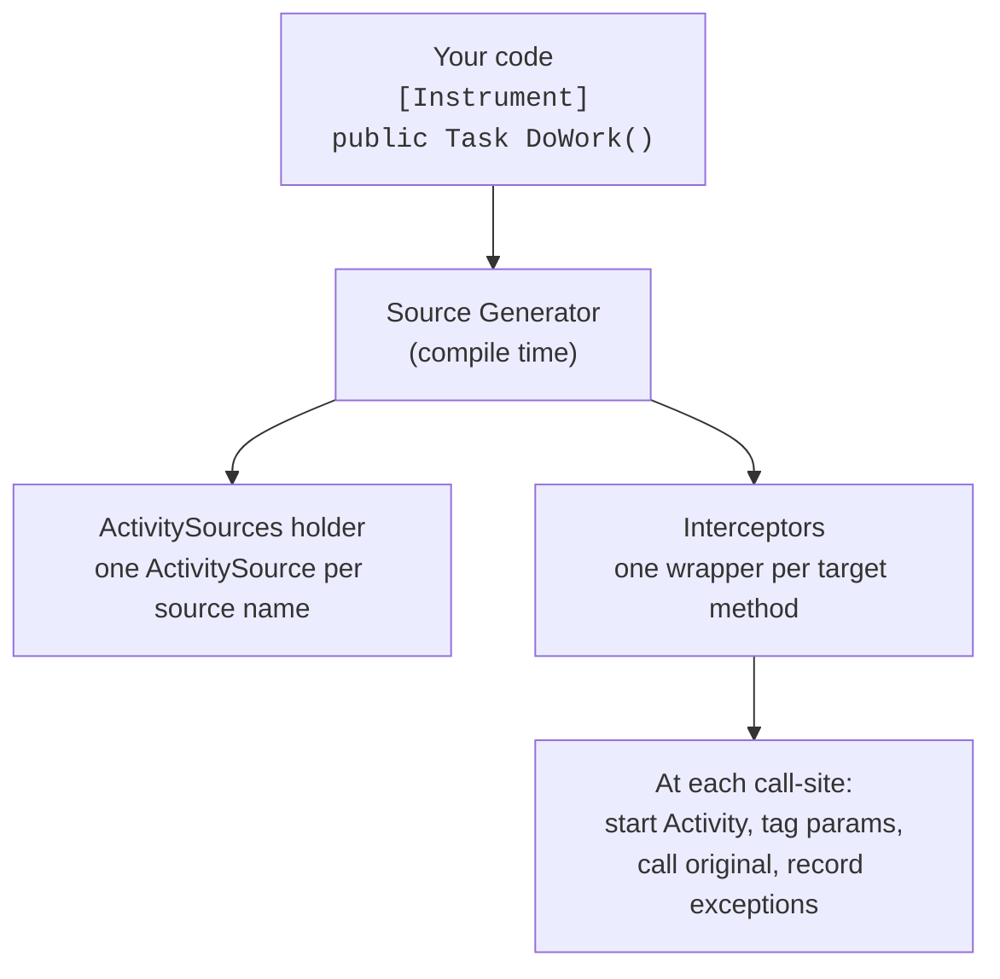

# AutoInstrument

Rust-style `#[instrument]` for .NET. Add `[Instrument]` to a method, get OpenTelemetry spans at every call-site.

## Usage

```csharp
public class YakService
{
    [Instrument]
    public async Task<string> ShaveYak(int yakId, string style)
    {
        await Task.Delay(50);
        return $"Yak #{yakId} shaved with {style}";
    }
}
```

Every call to `ShaveYak` is intercepted at compile time with a wrapper that starts an `Activity`, tags it with the method parameters, and records exceptions.

## How it works



The generator uses C# **interceptors** to rewrite call-sites at compile time. Your original method is never modified.

## Before & after

**Before** (manual OpenTelemetry):

```csharp
private static readonly ActivitySource _source = new("MyApp");

public async Task<string> ShaveYak(int yakId, string style)
{
    using var activity = _source.StartActivity("YakService.ShaveYak");
    activity?.SetTag("shaveyak.yakid", yakId.ToString());
    activity?.SetTag("shaveyak.style", style);
    try
    {
        await Task.Delay(50);
        return $"Yak #{yakId} shaved";
    }
    catch (Exception ex)
    {
        activity?.SetStatus(ActivityStatusCode.Error, ex.Message);
        throw;
    }
}
```

**After**:

```csharp
[Instrument]
public async Task<string> ShaveYak(int yakId, string style)
{
    await Task.Delay(50);
    return $"Yak #{yakId} shaved";
}
```

## Getting started

Add the packages and enable interceptors in your `.csproj`:

```xml
<PropertyGroup>
  <InterceptorsNamespaces>$(InterceptorsNamespaces);AutoInstrument.Generated</InterceptorsNamespaces>
</PropertyGroup>
```

Then annotate your methods:

```csharp
using AutoInstrument;

public class OrderService
{
    [Instrument]
    public async Task<Order> ProcessOrder(int orderId, string customer) { ... }

    [Instrument(Skip = new[] { "creditCard" })]
    public async Task ChargeCustomer(int orderId, string creditCard) { ... }

    [Instrument(Name = "orders.compute_total", RecordReturnValue = true)]
    public decimal ComputeTotal(List<LineItem> items) => items.Sum(i => i.Price * i.Quantity);
}
```

## Configuration

### ActivitySource name resolution

By default, the ActivitySource name is the assembly name. You can override it at three levels (highest priority first):

1. **Per-method** — `[Instrument(ActivitySourceName = "X")]`
2. **MSBuild property** — `<AutoInstrumentSourceName>X</AutoInstrumentSourceName>` in your `.csproj`
3. **Assembly attribute** — `[assembly: AutoInstrumentSource("X")]`
4. **Assembly name** — fallback

#### MSBuild property

```xml
<PropertyGroup>
  <AutoInstrumentSourceName>MyApp</AutoInstrumentSourceName>
</PropertyGroup>
```

#### Assembly attribute

```csharp
using AutoInstrument;

[assembly: AutoInstrumentSource("MyApp")]
```

Both approaches set the default for all `[Instrument]` methods in the project. The per-method `ActivitySourceName` always takes priority.

## Attribute options

| Property | Default | Description |
|---|---|---|
| `Name` | `Class.Method` | Span name |
| `Skip` | `null` | Parameters to exclude from tags |
| `Fields` | `null` | Only these parameters become tags |
| `ActivitySourceName` | Assembly name | Custom ActivitySource name |
| `RecordReturnValue` | `false` | Tag the return value |
| `RecordException` | `true` | Record exceptions on span |
| `Kind` | `0` (Internal) | ActivityKind (0-4) |

## Rust comparison

| | Rust `#[instrument]` | C# `[Instrument]` |
|---|---|---|
| Auto-capture params | yes | yes |
| Skip params | `skip(pwd)` | `Skip = ["pwd"]` |
| Custom span name | `name = "x"` | `Name = "x"` |
| Record return | `ret` | `RecordReturnValue = true` |
| Zero runtime cost | proc macro | source gen + interceptor |
| Modifies user code | no | no |

## Limitations

- **Same compilation only** -- interceptors can only intercept call-sites within the same project.
- **Recursive calls are intercepted** -- creates nested spans

## Requirements

- .NET 10

## Building

```bash
dotnet build
dotnet run --project samples/SampleApp
```

## License

MIT
