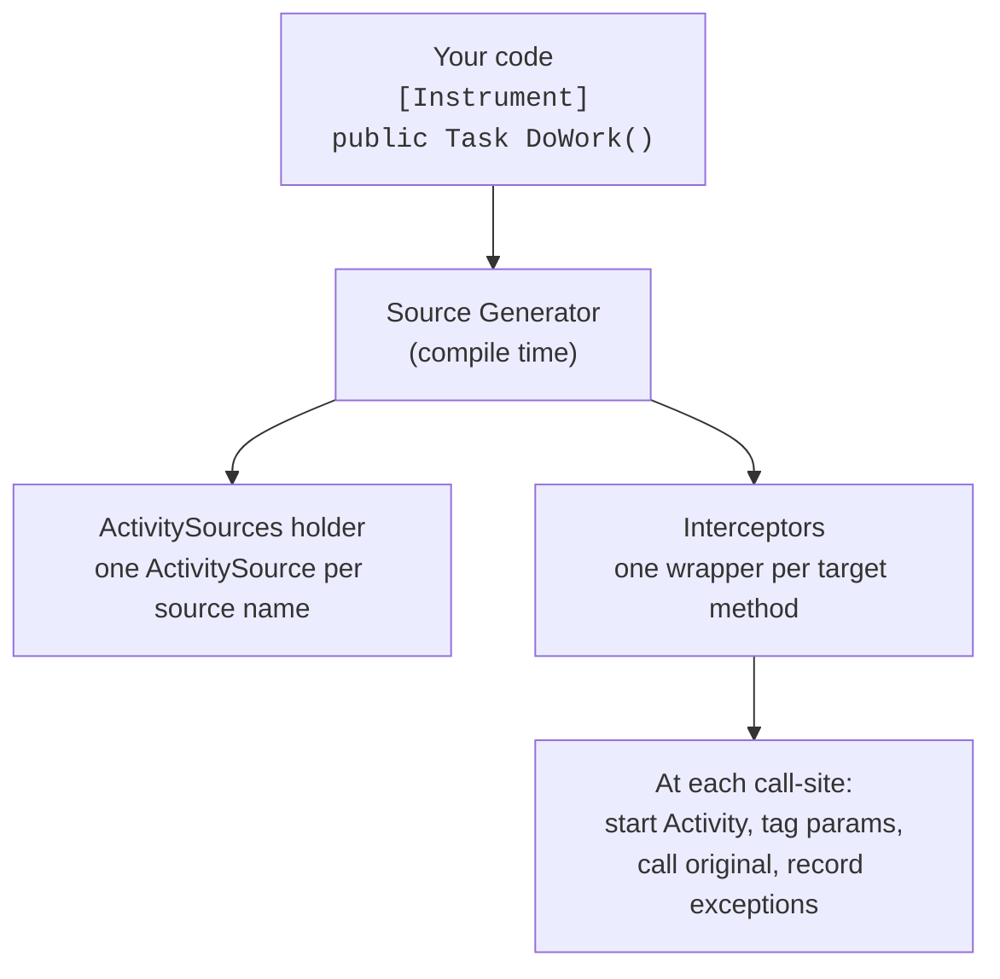

# AutoInstrument

Rust-style `#[instrument]` for .NET. Add `[Instrument]` to a method, get OpenTelemetry spans at every call-site.

## Usage

```csharp
public class YakService
{
    [Instrument]
    public async Task<string> ShaveYak(int yakId, string style)
    {
        await Task.Delay(50);
        return $"Yak #{yakId} shaved with {style}";
    }
}
```

Every call to `ShaveYak` is intercepted at compile time with a wrapper that starts an `Activity`, tags it with the method parameters, and records exceptions.

## How it works



The generator uses C# **interceptors** to rewrite call-sites at compile time. Your original method is never modified.

## Before & after

**Before** (manual OpenTelemetry):

```csharp
private static readonly ActivitySource _source = new("MyApp");

public async Task<string> ShaveYak(int yakId, string style)
{
    using var activity = _source.StartActivity("YakService.ShaveYak");
    activity?.SetTag("shaveyak.yakid", yakId.ToString());
    activity?.SetTag("shaveyak.style", style);
    try
    {
        await Task.Delay(50);
        return $"Yak #{yakId} shaved";
    }
    catch (Exception ex)
    {
        activity?.SetStatus(ActivityStatusCode.Error, ex.Message);
        throw;
    }
}
```

**After**:

```csharp
[Instrument]
public async Task<string> ShaveYak(int yakId, string style)
{
    await Task.Delay(50);
    return $"Yak #{yakId} shaved";
}
```

## Getting started

Enable interceptors in your `.csproj`:

```xml
<PropertyGroup>
  <InterceptorsNamespaces>$(InterceptorsNamespaces);AutoInstrument.Generated</InterceptorsNamespaces>
</PropertyGroup>
```

Then annotate your methods:

```csharp
using AutoInstrument;

public class OrderService
{
    [Instrument]
    public async Task<Order> ProcessOrder(int orderId, string customer) { ... }

    [Instrument(Skip = new[] { "creditCard" })]
    public async Task ChargeCustomer(int orderId, string creditCard) { ... }

    [Instrument(Name = "orders.compute_total", RecordReturnValue = true)]
    public decimal ComputeTotal(List<LineItem> items) => items.Sum(i => i.Price * i.Quantity);
}
```

## Attribute options

### `Name`

Override the span name. Defaults to `ClassName.MethodName`.

```csharp
[Instrument(Name = "orders.process")]
public async Task ProcessOrder(int orderId) { ... }
// Span name: "orders.process" instead of "OrderService.ProcessOrder"
```

### `Skip`

Parameter names to exclude from span tags. Use for sensitive data. Supports dot-notation for complex type properties.

```csharp
// Skip a simple parameter
[Instrument(Skip = new[] { "password" })]
public void Login(string username, string password) { ... }
// Tags: login.username ✓  login.password ✗

// Skip a specific property of a complex type
[Instrument(Skip = new[] { "order.CreditCard" })]
public void Process(Order order) { ... }
// Tags: process.order.id ✓  process.order.name ✓  process.order.creditcard ✗

// Skip an entire complex parameter
[Instrument(Skip = new[] { "credentials" })]
public void Auth(Credentials credentials, int userId) { ... }
// Tags: auth.userid ✓  (nothing from credentials)
```

### `Fields`

Whitelist of parameters to tag. When set, only these parameters are captured. Takes precedence over `Skip`. Supports dot-notation.

```csharp
// Only tag specific parameters
[Instrument(Fields = new[] { "orderId" })]
public void Process(int orderId, string name, string secret) { ... }
// Tags: process.orderid ✓  process.name ✗  process.secret ✗

// Only tag specific properties of a complex type
[Instrument(Fields = new[] { "order.Id", "order.Name" })]
public void Process(Order order) { ... }
// Tags: process.order.id ✓  process.order.name ✓  process.order.secret ✗
```

### `ActivitySourceName`

Override the ActivitySource name for this specific method. See [Configuration](#configuration) for project-wide defaults.

```csharp
[Instrument(ActivitySourceName = "MyApp.Orders")]
public void ProcessOrder(int orderId) { ... }
```

### `RecordReturnValue`

Tag the return value on the span. Default: `false`.

```csharp
[Instrument(RecordReturnValue = true)]
public string GetStatus(int id) { return "active"; }
// Tags: getstatus.id, getstatus.return_value
```

### `RecordException`

Whether to record exceptions on the span with status, type, message, and stacktrace. Default: `true`.

```csharp
// Disable exception recording
[Instrument(RecordException = false)]
public void DoWork() { ... }
// No try/catch wrapper — exceptions propagate without being recorded on the span
```

### `Kind`

The `ActivityKind` for the span. Default: `0` (Internal).

| Value | Kind |
|---|---|
| `0` | Internal |
| `1` | Server |
| `2` | Client |
| `3` | Producer |
| `4` | Consumer |

```csharp
[Instrument(Kind = 2)] // Client
public async Task<string> CallExternalApi(string endpoint) { ... }
```

### Summary

| Property | Default | Description |
|---|---|---|
| `Name` | `Class.Method` | Span name |
| `Skip` | `null` | Parameters/properties to exclude from tags |
| `Fields` | `null` | Only these parameters/properties become tags |
| `ActivitySourceName` | Assembly name | Custom ActivitySource name |
| `RecordReturnValue` | `false` | Tag the return value |
| `RecordException` | `true` | Record exceptions on span |
| `Kind` | `0` (Internal) | ActivityKind (0-4) |

## Complex types

Parameters that are classes or structs are automatically expanded into their public properties as individual span tags.

```csharp
public class Order
{
    public int Id { get; set; }
    public string Customer { get; set; }
    public string CreditCard { get; set; }
}

[Instrument]
public void Process(Order order, int priority) { ... }
// Tags: process.order.id, process.order.customer, process.order.creditcard, process.priority
```

Primitive types (`int`, `string`, `bool`, `decimal`, `DateTime`, `Guid`, enums, etc.) are tagged directly with their value. Complex types are expanded 1 level deep.

Use `Skip` and `Fields` with dot-notation to control which properties are tagged:

```csharp
[Instrument(Skip = new[] { "order.CreditCard" })]
public void Process(Order order) { ... }
// Tags: process.order.id ✓  process.order.customer ✓  process.order.creditcard ✗

[Instrument(Fields = new[] { "order.Id" })]
public void Process(Order order) { ... }
// Tags: process.order.id ✓  (nothing else)
```

## Configuration

### ActivitySource name

By default, the ActivitySource name is the assembly name. Override it at three levels (highest priority first):

1. **Per-method** -- `[Instrument(ActivitySourceName = "X")]`
2. **MSBuild property** -- `<AutoInstrumentSourceName>X</AutoInstrumentSourceName>`
3. **Assembly attribute** -- `[assembly: AutoInstrumentSource("X")]`
4. **Assembly name** -- fallback

#### MSBuild property

```xml
<PropertyGroup>
  <AutoInstrumentSourceName>MyApp</AutoInstrumentSourceName>
</PropertyGroup>
```

#### Assembly attribute

```csharp
using AutoInstrument;

[assembly: AutoInstrumentSource("MyApp")]
```

Both set the default for all `[Instrument]` methods in the project. The per-method `ActivitySourceName` always wins.

## Diagnostics

The analyzer validates `Skip` and `Fields` at compile time:

| ID | Message |
|---|---|
| `AUTOINST001` | `'{name}' in Skip is not a parameter of '{method}'` |
| `AUTOINST002` | `'{name}' in Fields is not a parameter of '{method}'` |
| `AUTOINST003` | `'{property}' is not a public property of parameter '{param}' (type '{type}') in '{method}'` |

```csharp
[Instrument(Skip = new[] { "pwd" })]           // AUTOINST001 — no parameter named 'pwd'
public void Login(string username, string password) { }

[Instrument(Skip = new[] { "order.Foo" })]      // AUTOINST003 — 'Foo' is not a property of Order
public void Process(Order order) { }
```

## Rust comparison

| | Rust `#[instrument]` | C# `[Instrument]` |
|---|---|---|
| Auto-capture params | yes | yes |
| Complex type expansion | no (uses Debug) | yes (public properties) |
| Skip params | `skip(pwd)` | `Skip = ["pwd"]` |
| Custom span name | `name = "x"` | `Name = "x"` |
| Record return | `ret` | `RecordReturnValue = true` |
| Zero runtime cost | proc macro | source gen + interceptor |
| Modifies user code | no | no |

## Limitations

- **Same compilation only** -- interceptors can only intercept call-sites within the same project.
- **Recursive calls are intercepted** -- creates nested spans.
- **1-level expansion** -- complex types expand public properties one level deep, not recursively.

## Requirements

- .NET 10

## Building

```bash
dotnet build
dotnet run --project samples/SampleApp
dotnet test
```

## License

MIT